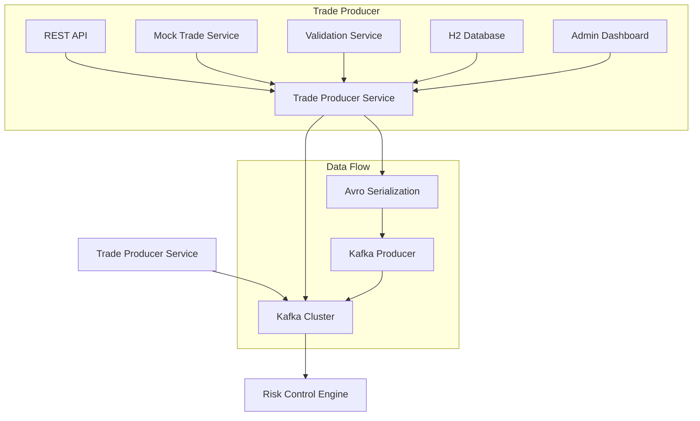

# Trade Producer Service


A Spring Boot microservice that generates and streams realistic cryptocurrency trade data to Kafka using Avro schemas. This service serves as the data source for the CodedStreams Risk Control Engine.

## 📋 Overview

The Trade Producer Service simulates real-world cryptocurrency trading activity by generating realistic trade events and publishing them to Kafka. It provides:

- **REST API** for manual trade production
- **Scheduled Mock Data Generation** for testing and development
- **Avro Serialization** using shared data contracts
- **H2 Database** for trade storage and auditing
- **Admin Endpoints** for monitoring and control

## 🏗️ Architecture



## 🚀 Quick Start

### Prerequisites

- Java 11 or higher
- Maven 3.6+
- Apache Kafka 3.4.0+
- CodedStreams Data Contracts Library

### Installation

1. **Clone and build the data contracts library first:**
   ```bash
   git clone https://github.com/codedstreams/crypto-risk-contract-library.git
   cd crypto-risk-contract-library
   mvn clean install
   ```

2. **Clone and run the trade producer:**
   ```bash
   git clone https://github.com/codedstreams/trade-producer-service.git
   cd trade-producer-service
   mvn spring-boot:run
   ```

3. **Using Docker Compose (recommended):**
   ```bash
   # Start all dependencies
   docker-compose up -d kafka zookeeper
   
   # Run the application
   mvn spring-boot:run
   ```

### Configuration

The service starts on `http://localhost:8080` with the following default configuration:

```yaml
server:
  port: 8080
  servlet:
    context-path: /api

spring:
  kafka:
    bootstrap-servers: localhost:9092

producer:
  kafka:
    topic: crypto-trades
  mock:
    enabled: true
    rate-ms: 500  # Generate trade every 500ms
```

## 📊 API Documentation

### Base URL
```
http://localhost:8080/api
```

### Trade Production Endpoints

#### Produce Single Trade
```http
POST /trades/produce
Content-Type: application/json
```

**Request Body:**
```json
{
  "userId": "USER_001",
  "customerId": "CUST_1001",
  "symbol": "BTC/USDT",
  "side": "BUY",
  "quantity": 0.5,
  "price": 45000.0,
  "orderType": "LIMIT",
  "exchange": "BINANCE",
  "walletAddress": "0x742d35Cc6634C0532925a3b8Df59B2f4aD7aB6F5"
}
```

**Response:**
```json
{
  "message": "Trade produced successfully"
}
```

#### Produce Batch of Trades
```http
POST /trades/produce-batch
Content-Type: application/json
```

**Request Body:**
```json
[
  {
    "userId": "USER_001",
    "customerId": "CUST_1001",
    "symbol": "BTC/USDT",
    "side": "BUY",
    "quantity": 0.5,
    "price": 45000.0
  },
  {
    "userId": "USER_002",
    "customerId": "CUST_1002",
    "symbol": "ETH/USDT",
    "side": "SELL",
    "quantity": 2.0,
    "price": 3000.0
  }
]
```

### Administration Endpoints

#### Get Producer Statistics
```http
GET /admin/stats
```

**Response:**
```json
{
  "totalTradesProduced": 1250,
  "successfulProductions": 1245,
  "failedProductions": 5,
  "lastProducedTimestamp": "2023-12-07T10:30:45.123",
  "startTime": "2023-12-07T08:00:00.000",
  "uptimeMinutes": 150,
  "successRate": 99.6
}
```

#### Control Mock Trading
```http
POST /admin/mock-trading/start
POST /admin/mock-trading/stop
GET /admin/mock-trading/status
```

**Status Response:**
```json
{
  "enabled": true,
  "running": true,
  "rateMs": 500,
  "users": ["USER_001", "USER_002", "USER_003"],
  "symbols": ["BTC/USDT", "ETH/USDT", "SOL/USDT"],
  "exchanges": ["BINANCE", "COINBASE", "KRAKEN"]
}
```

#### Health Check
```http
GET /admin/health
```

**Response:**
```json
{
  "status": "UP",
  "service": "trade-producer",
  "timestamp": "2023-12-07T10:30:45.123Z"
}
```

## 💻 Usage Examples

### Using cURL

**Produce a single trade:**
```bash
curl -X POST http://localhost:8080/api/trades/produce \
  -H "Content-Type: application/json" \
  -d '{
    "userId": "USER_001",
    "customerId": "CUST_1001",
    "symbol": "BTC/USDT",
    "side": "BUY",
    "quantity": 0.1,
    "price": 45000.0
  }'
```

**Start mock trading:**
```bash
curl -X POST http://localhost:8080/api/admin/mock-trading/start
```

### Using JavaScript

```javascript
// Produce a trade
const response = await fetch('http://localhost:8080/api/trades/produce', {
  method: 'POST',
  headers: {
    'Content-Type': 'application/json',
  },
  body: JSON.stringify({
    userId: 'USER_001',
    customerId: 'CUST_1001',
    symbol: 'BTC/USDT',
    side: 'BUY',
    quantity: 0.5,
    price: 45000.0
  })
});

const result = await response.json();
console.log(result);
```

### Using Python

```python
import requests

# Produce a trade
trade_data = {
    "userId": "USER_001",
    "customerId": "CUST_1001",
    "symbol": "BTC/USDT",
    "side": "BUY",
    "quantity": 0.2,
    "price": 45000.0
}

response = requests.post(
    "http://localhost:8080/api/trades/produce",
    json=trade_data
)

print(response.json())
```

## 🔧 Configuration

### Application Properties

```yaml
# src/main/resources/application.yml

# Kafka Configuration
spring:
  kafka:
    bootstrap-servers: localhost:9092
    producer:
      acks: all
      retries: 3
      batch-size: 16384
      buffer-memory: 33554432
      properties:
        enable.idempotence: true

# Producer Settings
producer:
  kafka:
    topic: crypto-trades
  mock:
    enabled: true
    rate-ms: 500
    users:
      - "USER_001"
      - "USER_002"
      - "USER_003"
      - "USER_004"
      - "USER_005"
    symbols:
      - "BTC/USDT"
      - "ETH/USDT"
      - "SOL/USDT"
      - "ADA/USDT"
      - "DOT/USDT"
    exchanges:
      - "BINANCE"
      - "COINBASE"
      - "KRAKEN"
      - "FTX"
      - "KUCOIN"

# Database
spring:
  datasource:
    url: jdbc:h2:mem:tradedb
  h2:
    console:
      enabled: true
      path: /h2-console

# Monitoring
management:
  endpoints:
    web:
      exposure:
        include: health,info,metrics,prometheus
```

### Environment Variables

All configuration can be overridden with environment variables:

```bash
export SPRING_KAFKA_BOOTSTRAP_SERVERS=kafka-cluster:9092
export PRODUCER_MOCK_RATE_MS=1000
export PRODUCER_MOCK_ENABLED=false
export SERVER_PORT=8081
```

## 🎯 Mock Data Generation

The service generates realistic trading data with the following characteristics:

### Supported Symbols & Default Prices
- **BTC/USDT**: $45,000 ± $1,000
- **ETH/USDT**: $3,000 ± $100
- **SOL/USDT**: $100 ± $10
- **ADA/USDT**: $1.00 ± $0.50
- **DOT/USDT**: $25.00 ± $5.00

### Realistic Quantity Ranges
- **BTC**: 0.001 - 0.1 BTC
- **ETH**: 0.01 - 1.0 ETH
- **SOL**: 0.1 - 10.0 SOL
- **ADA**: 10 - 1000 ADA
- **DOT**: 1 - 100 DOT

### Trading Patterns
- 70% LIMIT orders, 30% MARKET orders
- Random buy/sell distribution
- Realistic price variations (±2%)
- Optional wallet addresses (30% of trades)
- Realistic IP address generation

## 🗄️ Database

### H2 Console
Access the in-memory database console at:
```
http://localhost:8080/h2-console
```

**Connection Details:**
- JDBC URL: `jdbc:h2:mem:tradedb`
- Username: `sa`
- Password: (leave empty)

### Database Schema

The service automatically creates the following tables:

#### trades Table
```sql
CREATE TABLE trades (
    trade_id VARCHAR(255) PRIMARY KEY,
    user_id VARCHAR(255) NOT NULL,
    customer_id VARCHAR(255) NOT NULL,
    symbol VARCHAR(50) NOT NULL,
    base_asset VARCHAR(50),
    quote_asset VARCHAR(50),
    side VARCHAR(10) NOT NULL,
    order_type VARCHAR(20),
    quantity DOUBLE NOT NULL,
    price DOUBLE NOT NULL,
    notional DOUBLE NOT NULL,
    timestamp BIGINT NOT NULL,
    exchange VARCHAR(50),
    wallet_address VARCHAR(255),
    risk_level VARCHAR(20),
    flagged BOOLEAN DEFAULT FALSE,
    risk_reason VARCHAR(255),
    created_at TIMESTAMP
);
```

#### Indexes
- `idx_user_id` - User-based queries
- `idx_timestamp` - Time-based analysis
- `idx_symbol` - Symbol-based aggregation
- `idx_trade_user_timestamp` - Composite index for user timeline

## 📈 Monitoring & Metrics

### Spring Boot Actuator Endpoints

- `/actuator/health` - Application health
- `/actuator/metrics` - Application metrics
- `/actuator/prometheus` - Prometheus metrics format

### Custom Metrics

The service tracks:
- Total trades produced
- Successful/failed productions
- Success rate percentage
- Uptime and performance statistics

### Logging

Structured logging with different levels:
```bash
# Set logging level
logging.level.com.codedstreams.producer=DEBUG
```

## 🔒 Security Considerations

### Input Validation
- All API inputs are validated using Bean Validation
- Symbol, side, and order type enforces
- Wallet address format validation
- Quantity and price positive checks

### Kafka Security
- Idempotent producer configuration
- Exactly-once semantics support
- Retry mechanisms for reliability

### Database Security
- In-memory H2 for development (replace with secured database for production)
- SQL injection protection via JPA
- Input sanitization

## 🚀 Deployment

### Local Development
```bash
mvn spring-boot:run
```

### Production Build
```bash
mvn clean package -DskipTests
java -jar target/trade-producer-1.0.0.jar
```

### Docker Deployment
```dockerfile
FROM openjdk:11-jre-slim
COPY target/trade-producer-1.0.0.jar app.jar
ENTRYPOINT ["java", "-jar", "/app.jar"]
```

```bash
docker build -t trade-producer:1.0.0 .
docker run -p 8080:8080 trade-producer:1.0.0
```

### Kubernetes Deployment
```yaml
apiVersion: apps/v1
kind: Deployment
metadata:
  name: trade-producer
spec:
  replicas: 2
  selector:
    matchLabels:
      app: trade-producer
  template:
    metadata:
      labels:
        app: trade-producer
    spec:
      containers:
      - name: trade-producer
        image: trade-producer:1.0.0
        ports:
        - containerPort: 8080
        env:
        - name: SPRING_KAFKA_BOOTSTRAP_SERVERS
          value: "kafka-cluster:9092"
```

## 🧪 Testing

### Running Tests
```bash
# Unit tests
mvn test

# Integration tests
mvn verify

# With coverage
mvn jacoco:report
```

### Test Categories
- **Unit Tests**: Service layer logic
- **Integration Tests**: Kafka and database integration
- **Validation Tests**: Input validation scenarios
- **Performance Tests**: Load and stress testing

### Example Test
```java
@Test
public void testTradeProduction() {
    ProduceTradeRequest request = createValidTradeRequest();
    
    tradeProducerService.produceTrade(request);
    
    verify(kafkaTemplate).send(anyString(), anyString(), any(byte[].class));
}
```

## 🔄 Integration with Risk Engine

### Data Flow
1. Trade Producer generates trade events
2. Events serialized to Avro and sent to Kafka
3. Risk Control Engine consumes and analyzes trades
4. Risk alerts generated for suspicious patterns

### Required Topics
```bash
# Create Kafka topic
kafka-topics.sh --create \
  --topic crypto-trades \
  --bootstrap-server localhost:9092 \
  --partitions 3 \
  --replication-factor 1
```

### Message Format
All messages use Avro binary format with the following schema:
- Key: User ID (String)
- Value: CryptoTrade (Avro binary)

## 🐛 Troubleshooting

### Common Issues

**Kafka Connection Failed**
```bash
# Check Kafka is running
kafka-topics.sh --list --bootstrap-server localhost:9092

# Verify topic exists
kafka-topics.sh --describe --topic crypto-trades --bootstrap-server localhost:9092
```

**H2 Console Not Accessible**
- Verify application is running on port 8080
- Check context path is `/api`
- H2 console available at `/h2-console`

**Trade Validation Errors**
- Check required fields: userId, customerId, symbol, side, quantity, price
- Validate symbol format: "BASE/QUOTE"
- Ensure quantity and price are positive numbers

### Logs Analysis

Check application logs for:
- Kafka producer errors
- Serialization issues
- Database connection problems
- Validation failures

## 🤝 Contributing

### Development Setup
1. Fork the repository
2. Install data contracts library first
3. Set up local Kafka cluster
4. Run tests to verify setup

### Code Standards
- Follow Spring Boot best practices
- Include comprehensive tests
- Update API documentation
- Use meaningful commit messages

### Branch Strategy
- `main`: Production-ready code
- `develop`: Development branch
- `feature/*`: New features
- `hotfix/*`: Critical bug fixes

## 📚 Additional Resources

- [Spring Boot Documentation](https://spring.io/projects/spring-boot)
- [Spring Kafka Reference](https://spring.io/projects/spring-kafka)
- [Apache Avro Documentation](https://avro.apache.org/)
- [Data Contracts Library](../crypto-risk-contract-library/README.md)

## 🆘 Support

For issues and questions:

1. Check application logs for error details
2. Verify Kafka cluster is accessible
3. Confirm data contracts library is installed
4. Create issue in GitHub repository
5. Contact development team

## 📄 License


---

**Maintained by**: CodedStreams Trading Platform Team  
**Last Updated**: October 2025  
**Dependencies**: Data Contracts Library v1.0.1+, Kafka 3.4+, Java 21+